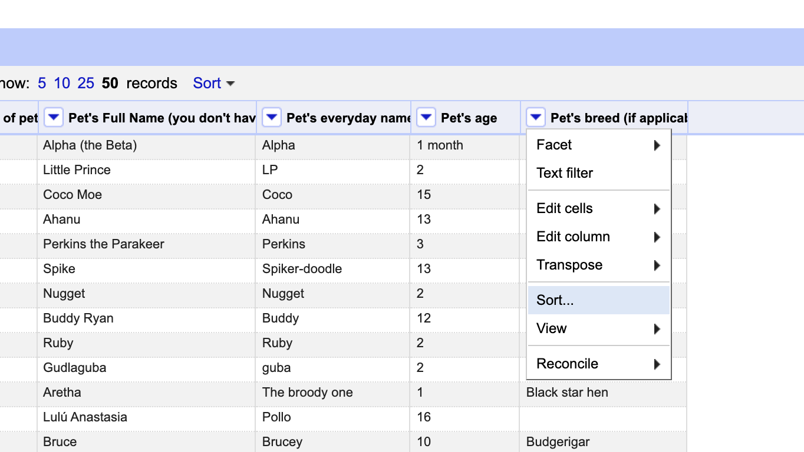

## Part 1: Data Cleaning

**Create Project**              

First, I created a new project in Open Refine and pasted the URL of the raw data from the PetNames.tsv file that I obtained from Github. Next, I created the project by clicking on the "Create Project" button in the top right.

**Sort**

To sort each column in the dataset, I selected the dropdown arrow at the top of each column and selected "sort". Next, I selected the appropriate cell value. If the column was the Pet's age, I'd select "numbers". For the rest of the columns, I selected "text".

**Removing Data**

Once the data was sorted, I removed fields such as "Cardboard Poster" and Kendall Jenner". There was also a Roomba that was removed from the dataset. If a cell did not have a clear meaning that could be determined from other cells in the row, it was removed. Although I did not remove any pets that were "mixed breed", I did label them as "Mutt".

**Cluster & Edit**

In order to shorten the list of similar values that portray the same meaning (Golden Retr., Golden Retreiver, Golden Retriever, etc.) I selected the dropdown arrow at the top of the column and selected "edit cells > cluster and edit..." before being brought to the next screen. Next, I selected "Select All" and reviewed each cluster; making sure the values were meant to be merged. I would also make corrections in the naming of the new cell value to ensure consistent nomenclature and format. Once I was confident the values were ready to be merged, I selected "Merge Selected & Re-Cluster". To further search for cluster cells, I'd select the keying function at the top of the pane and change "fingerprint" to ngram-fingerprint, metaphone3, cologne-phonetic, Daitch-Mokotoff and Beider-Morse until I've exhausted and reviewed the list of possible clusters to be made. 

**Facets**

In order to search for specific values of sub-categories, I selected the column's drop-down arrow and clicked "facet". Next, I clicked "Text Facet" and moved to the left column of Open Refine. There, I was able to sort by name or count which placed the category with the greatest value at the top of the list. The facets lead to the majority of answers in Homework 2.

## Part 2: Analyze Cleaned Data

*1. How many types (kinds) of pets are there?* 

     23

*2. How many dogs?* 

     1131

*3. How many breeds of dogs?* 

     358

*4. What's the most popular dog breed?* 

     Golden Retriever

*5. What's the age range of the dogs?* 

     0-20

*6. What's the age range of the guinea pigs?* 

     1-5

*7. What is the oldest pet?* 

     Cat , 24, Bruce Springsteen 

*8. Which are more popular, betta fish or goldfish? How many of each?* Betta fish are more popular.* 

     (11) Betta Fish and (3) Gold fish

*9. What's the most popular everyday name for a cat?* 

     Kitty

*10. What's the most popular full name for a dog?* 

     Maggie

## References
* Insert Reference 1, https://www.google.com/search?q=is+a+mixed+breed+a+pure+breed%3F&rlz=1C5CHFA_enUS864US865&oq=is+a+mixed+breed+a+pure+breed%3F&aqs=chrome..69i57j33i22i29i30.12546j0j7&sourceid=chrome&ie=UTF-8
Insert Reference 2, https://www.google.com/search?q=rodent+family&rlz=1C5CHFA_enUS864US865&oq=rodent&aqs=chrome.0.69i59j46i433i512j0i457i512j0i402l2j0i433i512l2j0i512j0i433i512j0i271.1913j0j7&sourceid=chrome&ie=UTF-8
